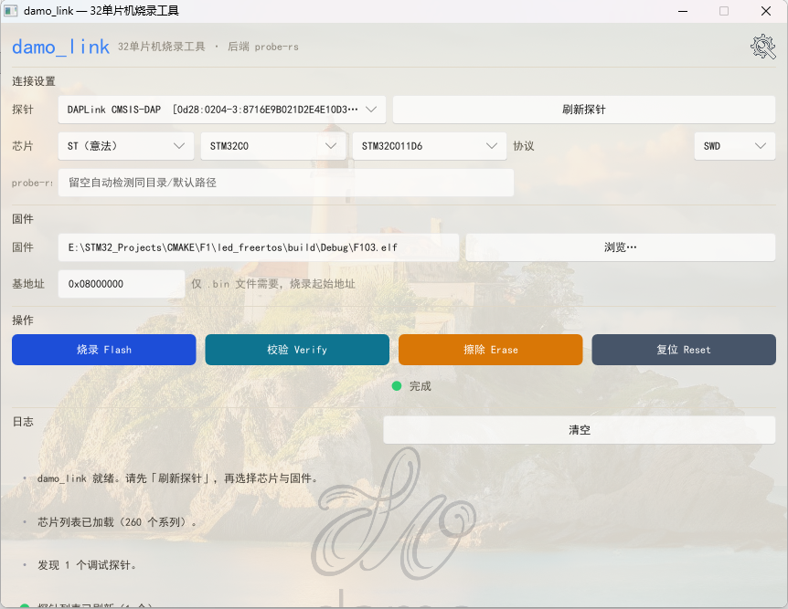
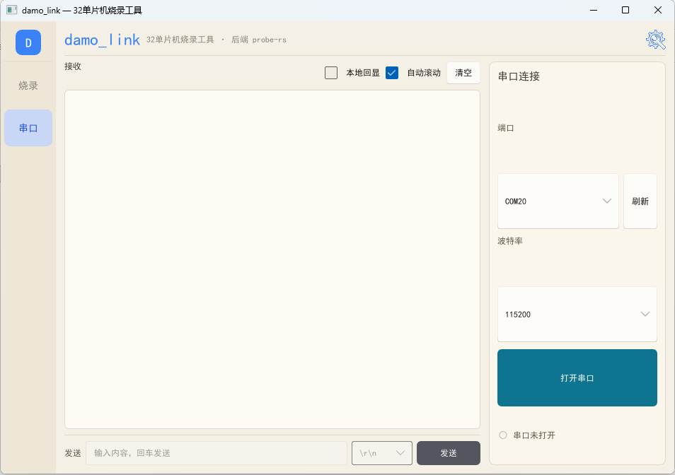

<p align="center">
  <h1 align="center">🔌 damo_link</h1>
  <p align="center">32 位单片机烧录工具 + 串口助手 · 基于 probe-rs 的 Windows 图形化工具</p>
</p>

<p align="center">
  
  
  
  
</p>

---

## 📸 界面预览

| 烧录页 | 串口助手页 |
|---|---|
|  |  |

## ✨ 功能特性

| | 功能 | 说明 |
|---|---|---|
| 🧭 | **左侧栏双页导航** | 左侧栏「烧录」/「串口」一键切换 |
| 🔌 | **串口调试页面** | 左侧接收区（等宽字体、本地回显、自动滚动、清空）+ 发送栏；右侧「串口连接」面板（端口枚举、波特率、打开/关闭、连接状态）；输入内容回车即发，行尾可选 |
| 🪟 | **窗口自适应** | 窗口可自由缩放 / 最大化，布局自动填满 |
| 🎨 | **三套主题** | 深色 / 米白色 / 白色，右上角齿轮一键切换 |
| 💾 | **配置自动保存** | 芯片、主题、协议、固件路径、串口端口/波特率等改动自动记住，下次打开自动恢复 |
| 🔍 | **探针自动枚举** | 自动发现 DAPLink / ST-Link / J-Link 等调试探针 |
| 🧩 | **芯片三级级联** | 厂商 → 系列 → 型号，逐级筛选 |
| 🇨🇳 | **华大 HC32F460** | HDSC HC32F460 全系列 9 个型号（J/K/P 封装，256K/512K），官方 CMSIS 闪存算法已打包进 exe，开箱即用 |
| ⚡ | **固件操作** | 烧录 / 校验 / 擦除 / 复位，烧录成功自动复位运行 |
| 📜 | **实时日志** | probe-rs 输出流式显示、自动滚底、按状态着色 |

## 🚀 快速开始

1. 下载本目录全部文件
2. 运行 `damo_link.exe`
3. **烧录**：点「刷新探针」→ 选择芯片 → 选择固件 → 点「烧录 Flash」
4. **串口调试**：点左侧「串口」→ 选端口和波特率 → 「打开串口」→ 在下方输入内容回车发送

## 📁 目录结构

```
damo_link/
├── damo_link.exe        # 主程序（GUI）
├── probe-rs/
│   └── probe-rs.exe     # 烧录后端（子进程调用）
├── png/
│   ├── 1.png            # 烧录页界面预览
│   └── 2.png            # 串口助手页界面预览
├── README.md
└── .gitignore
```

## ⚙️ 说明

- 烧录后端 `probe-rs\probe-rs.exe` 需与主程序保持同一目录结构，否则可在「设置」中手动指定路径
- 首次运行后会在同目录生成 `damo_link_config.json` 保存你的设置（该文件不随仓库分发）

## 📋 更新记录

### v2.1

- 🆕 **新增华大半导体 HC32F460 系列烧录支持**：芯片列表出现「HDSC（华大半导体）→ HC32F460-Series」，共 9 个型号（HC32F460JCTA / JETA / JEUA / KCTA / KETA / KEUA / PCTB / PEHB / PETB）；基于 HDSC 官方 CMSIS Pack 的闪存算法（256K / 512K / OTP），已内嵌进 exe，无需任何额外配置文件
- 🎨 **全套更换 DAMO LINK 新图标**：exe 文件图标、窗口标题栏图标、任务栏图标
- 🔧 修复交叉编译（WSL → windows-gnu）时 exe 图标从未被嵌入的问题
- 📦 单文件化：HC32F460 芯片描述编译期内嵌，运行时自动释放，发布只需一个 exe

### v2

- 用 Slint 重写界面（原生 GUI）；串口调试页面、左侧栏双页导航、窗口自适应缩放
